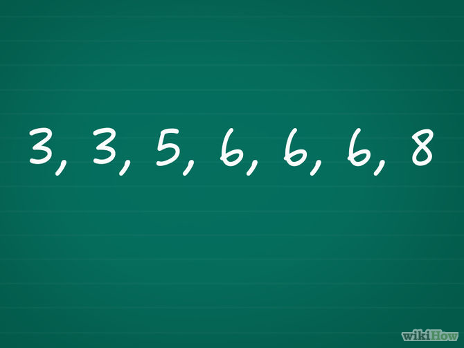
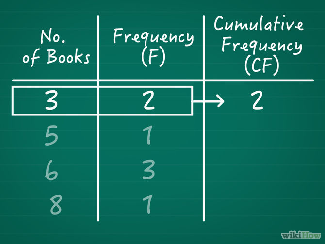
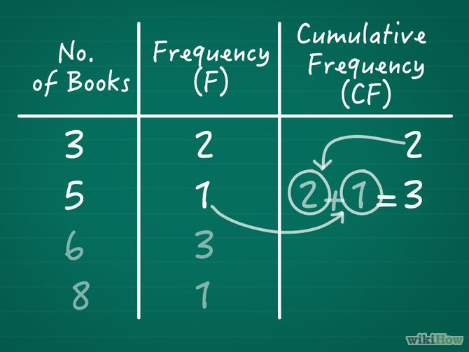
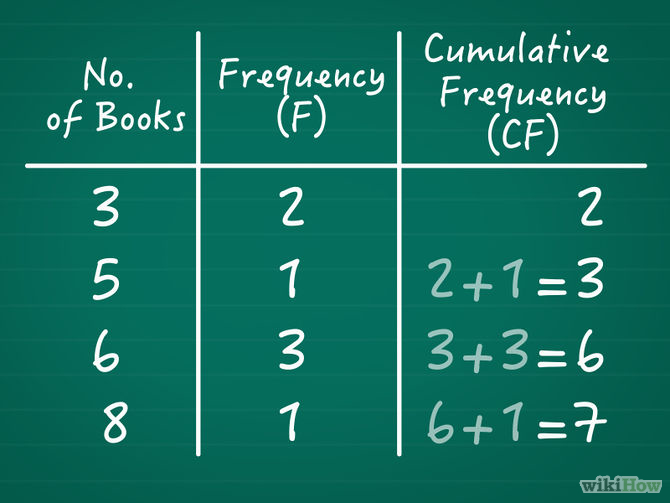

# distribuicao dos dados


Calcula a distribuicao dos dados analizados podendo ser Quartil, Decil e Percentil, sua fórmula é:

```js
li+((i*(N/valor)-Fant)/fmd)*h;
```

E sua variáveis são:

- N: somatorio das frequencias
- valor: valor de divisão podendo ser:
  - 4, 10, 100
- Fant: frequencia acumulada anterior

Para criarmos um algoritmo para solucionar esse problema devemos iniciar pelo cálculo mais interno `(N/valor)`, então antes de tudo devemos entender o que ele faz.

## (N/valor)

Se podemos receber os valores 4, 10 e 100 para ele então notamos que ele separa nossos valores em partes, criando uma proporção. Por exemplo:

```
100/4 = 25 ou seja é uma proporção de 25 para 1
100/10 = 10 ou seja é uma proporção de 10 para 1
100/100 = 1 ou seja é uma proporção de 1 para 1
```

## i*(N/valor)

## Fant - Frequencia Acumulada Anterior - (i*(N/valor)-Fant)





Depois devemos subtrair desse valor a frequencia acumulada anterior, para isso precisamos entender de onde vem esse valor. A `Fant` está ligada à frequencia(fi) e a frequencia nos diz **quantos números existem na faixa dos valores estipulados**, exemplo:

```
525|-580 = 8
```

Significa que temos 8 valores dentro dessa faixa que queremos analisar.

Já a `Fant` que é frequencia acumulada anterior será calculada como a soma da frequencia atual com a próxima frequencia.

## ((i*(N/valor)-Fant)/fmd)

## ((i*(N/valor)-Fant)/fmd)*h

## li+((i*(N/valor)-Fant)/fmd)*h

