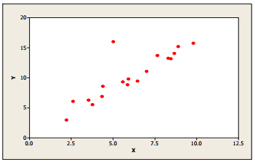
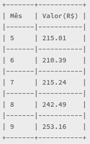
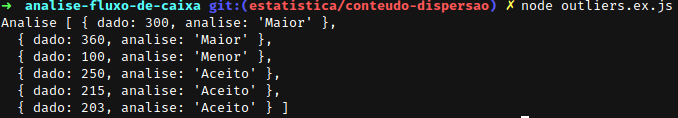

# Projeto: Análise de fluxo de caixa

*Obs: Esse projeto é uma demonstração de como ferramentas simples da matemática podme nos ajudam a resolver problemas complexos de forma bem simplificada. Existem meios melhores para esse problema, porém de uma forma mais avançada.* 

## Introdução

A detecção de outliers é uma das questões básicas da estatística. Um *outlier* é definido como:

>"An outlying observation, or "outlier," is one that appears to deviate markedly from other members of the sample in which it occurs." 
[1]:http://www.tandfonline.com/doi/abs/10.1080/00401706.1969.10490657

Traduzindo: "Uma observação distante, ou *outlier*, é uma que desvia-se marcadamente de outros membos da amostra da qual ocorre."

<p align="center">
  
  </p>
<p>
  <i>Figura 1: Um possível outlier na amostra de dados bivariados. A presença deste ponto tem uma forte influência no valor da correlação entre *X* e *Y*, reduzindo de 0.97 para 0.86.</i>
</p>

Isso significa que um *outlier* pode indicar que algo está de errado com aquele ponto o

Um *outlier* pode ser apenas uma manifestação extrema da variação dos dados, o que faria com que ele tivesse de ser adicionado aos cálculos. Por outro lado, pode indicar que há algo de errado com aquela informação, podendo ser erros de cálculo, erros na entrada de informação ou até mesmo um defeito.

## Hipótese

O projeto consiste na construção de um algorítimo capaz de identificar anomalias no fluxo de caixa. Isso significa que ele poderá:

* Identificar gastos acima ou abaixo esperado (o que pode indicar que alguma coisa está errada).
* Identificar contas não pagas em um determinado período.
* Identificar corrupção nos gastos públicos.

Utilizaremos a estatística para tal tarefa.

### Exemplo de uso:

1) Um belo dia o gestor de um pequeno negócio, esqueceu de pagar a conta de luz do mês de janeiro. No mês de fevereiro ele efetuou o pagamento das suas respectivas contas, sem notar que houve um erro no mês de janeiro, o que acarretou um corte no fornecimento da energia elétrica no mês de abril. Tal problema poderia ser evitado caso este algorítimo estivesse em funcionamento, afinal ele iria dizer que algo de errado ocorreu com a conta da energia no mês de janeiro!

2) Com uma ferramenta de monitoramento dos gastos públicos, pode-se identificar compras possivelmente superfaturadas utilizando a ideia básica deste algorítimo.

## Teoria

O primeiro passo é entender os dados. Iremos trabalhar com dados reais da conta de telefone e internet de um estabelecimento comercial aqui denominado *Loja 95*. Sendo a nossa amostra:

<p align="center">
Figura 1<br>
  
  </p>

Um outlier pode ser identificado através da determinação de um critério, o qual deve-se ser comparado para determinar se este é um outlier ou não. 

A distribuição normal ou distribuição gaussiana é a distribuição dos dados de acordo com a frequência, ela sempre toma a forma de sino. Onde  µ = Média Aritimética,  σ = Desvio padrão. Quando mais afastado da Média, maior a menor é a probabilidade de um determinado dado acontecer.
 
<p align="center">Figura 2<br></p>

Baseando-se na distribuição dos dados, podemos concluir que um dado futuro 4 vezes maior que o devio padrão - a média, definido por { -4σ - µ, 4σ - µ } , tem a probabilidade de 0,003% de acontecer, o que **pode** indicar alguma anomalia, sendo necessário uma revisão deste dado.

## Desenvolvimento

Nosso algorítimo tem de aprender o padrão dos dados, depois comparar com os dados atuais (e os futuros), caso o resultado seja um outlier ele avisará ao operador que foi encontrado uma anomalia e será **ignorado** em cálculos futuros. Este operador avaliará se realmente é uma anomalia ou se é "apenas uma manifestação extrema da variação dos dados", o qual deverá ser adicionado ao aprendizado do algorítimo. Focaremos na detecção da anomalia.

A primeira função deve ser a de aprendizado, esta função deve retornar informações básicas do nosso dados, como a Média, o Desvio padrão e a Curva de Gauss (Distribuição normal).

```js
// gauss :: Float -> Float -> Object
const gauss = (media, desvio) => {
  const calc = (x) => {
    const maior = (x) => x == 0 ? media : media + (x * desvio)
    const menor = (x) => x == 0 ? media : media - (x * desvio)
    return {'maior': maior(x), 'menor': menor(x)}
  }

  return [0,1,2,3].map(calc)
}
```

Temos como centro, ou o ponto mais alto da distribuição, a média, subsequente as outras divisões da curva (como na Figura 2).

A função *gauss* recebe dois parâmetros, a Média Aritimética e o [Desvio Padrão Amostral](www.github.com) (Conteúdo Webschool). 

A média pode ser cálculada através da Soma dos itens, divido pela quantidade dos itens, já o desvio padrão amostral é definido por:

<p align="center">Figura 3<br></img>

Estes dois itens são informações extraídas do nossos dados, através da função  ```aprender``` :

```js
// aprender :: [Float] -> Object {Float, Float, Object}
const aprender = (dados) => {
  const m = mediaCalc(dados)
  const d = desvio(dados, 'amostra')
  const g = gauss(m, d)

  return { media: m, desvio: d, gauss: g}
}
```
Em nosso estudo nos buscamos encontrar os *outliers* de nossos dados. Já temos a nossa Curva de Gauss, basta apenas que analisemos os dados.

```js
// detectaAnomalia :: [Float] -> Int :: Float -> [ Object {Float, String} ] 
const detectaAnomalia = (treino, RIGIDEZ) => (dado) => {
  return dado >= treino.gauss[RIGIDEZ].maior 
    ? {'dado': dado, analise: 'Maior'}
    : dado <= treino.gauss[RIGIDEZ].menor
      ? {'dado': dado, analise: 'Menor'}
      : {'dado': dado, analise: 'Aceito'}
}

// analise :: [Float] -> [Float] -> Int -> [Float]
const analise = (treino, dados, rigidez) => {
  const aprendido = aprender(treino)
  return dados.map(detectaAnomalia(aprendido, rigidez))
}
```

Para usarmos, basta apenas chamar a função analise, onde podemos definir os níveis de rigidez para 1, 2 ou 3, sendo o 1 mais rígido e o 3 mais leve. 

```
const algoritimo = require('./analise.js');

const rigidez = 3
const INFO_TREINO = [215.01, 210.39, 215.24, 242.49, 253.16]
const dados = [300.00, 360, 100, 250.00, 215, 203]
const resultado = algoritimo.analise(INFO_TREINO, dados, rigidez)
console.log('Analise', resultado)
```

A qual nos dara o seguinte resultado:

<p></p>

-----------
Essa série de estudos ainda não está finalizada, porém, aqui temos uma noção de uma aplicação das ferramentas, básicas, que a matemática nos fornece.


